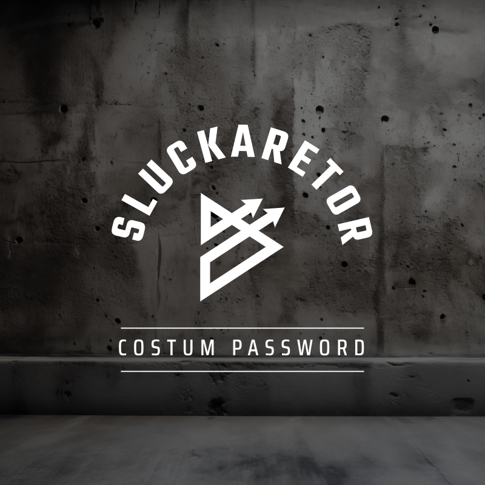

# Sluckaretor - Costumize password payload

<p align="center">

</p>


## Introduction to Sluckaretor

**Sluckaretor** is a customizable password generator that allows you to create strong, personalized passwords based on specific user inputs such as name, pet name, birthday, and more. The tool offers two modes: a comprehensive password generator that explores a wide range of combinations, and a faster, simplified version for quicker results.

## Features

- **Customizable Passwords:** Generate passwords using various personal data points.
- **Two Modes:** Choose between a slow, thorough password generation process and a faster version.
- **Terminal Animations:** Enjoy a visually pleasing user experience with terminal animations and colors.

## Installation


```bash
git clone https://github.com/awiones/Sluckaretor.git
cd Sluckaretor
python sluckaretor.py
```

### Main Menu Options

- **[1] Password Creator:** Generates a wide variety of password combinations using all available inputs.
- **[2] Password Custom (Fast):** Generates a simplified set of password combinations for quicker results.

## Example

When you run the script, you'll be asked for details like the first name, last name, pet name, birthday, etc. Based on your inputs, the tool will generate a list of possible passwords and save them in a text file named after the provided first name.

## Contributing

Contributions are welcome! If you have suggestions, improvements, or bug fixes, please submit a pull request or open an issue.

- **Fork the Repository**: Create a personal copy of the repository on GitHub.
- **Make Changes**: Implement your changes and test them locally.
- **Submit a Pull Request**: Describe your changes and submit a pull request for review.

## License

This project is licensed under the MIT License. See the [LICENSE](LICENSE) file for details.

---

Made with ❤️ by Awiones
